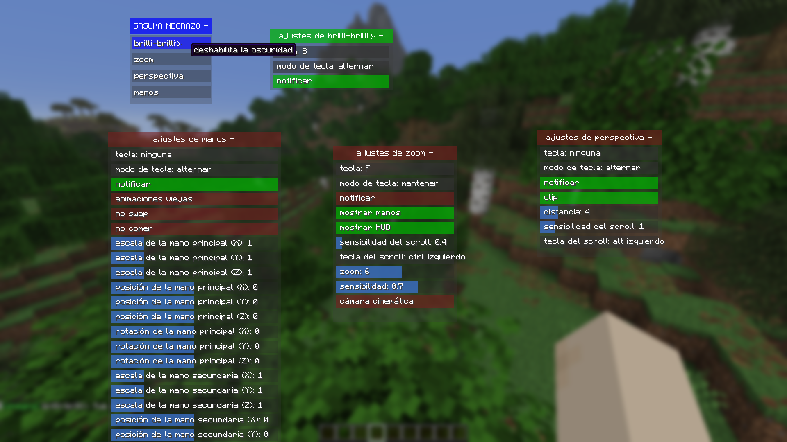
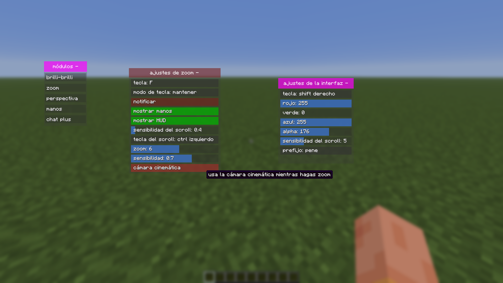
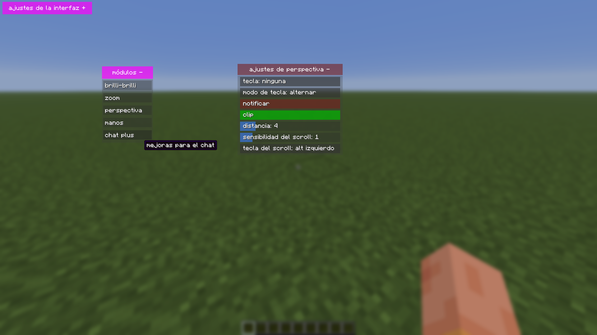
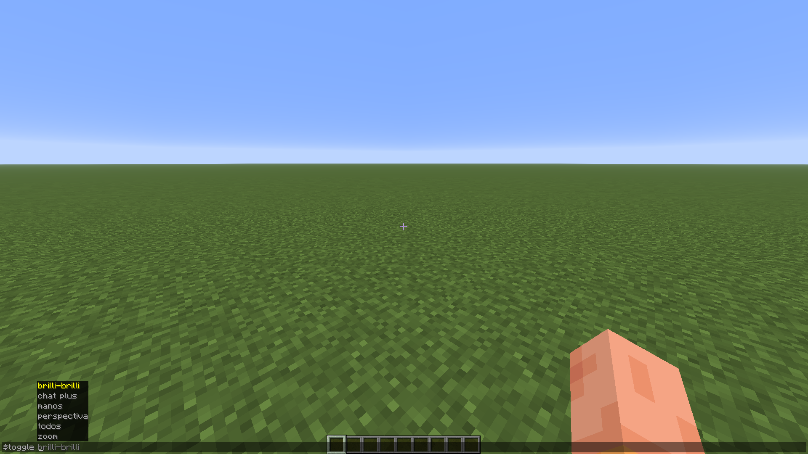

# jenny's mod 2 100% real

mod para Minecraft Fabric 1.21.6 que añade algunas cosas QOL, mayormente relacionadas a la cámara.

## instalación

### para gente normal:
1. ir a [lanzamientos](https://github.com/retuci0/camera-tweaks/releases)
2. selecionar la versión más reciente
3. descargar el .jar
4. moverlo a tu directorio de mods (probablemente `%appdata%/.minecraft/mods`)

asegúrate de tener una version de Minecraft y Fabric compatibles con el mod

### para frikis de 200 de iq
1. clona el respositorio
2. `gradlew build` para Windows o `chmod +x gradlew` + `./gradlew build` para Linux
3. el resultado estará en `/build/libs` (el que no lleva "sources" en el nombre)

## uso

`shift derecho` por defecto para abrir la interfaz

`$` como prefijo por defecto para comandos (se autocompletan)

## interfaz

- clic izquierdo para activar / desactivar módulos
- clic derecho para abrir sus ajustes
- clic izquierdo + arrastrar para mover marcos
- clic derecho en la cabeza del marco para expandirlo / contraerlo o para cerrarlo
- clic izquierdo sobre ajustes para modificarlos
- shift + clic derecho sobre ajustes para restablecerlos
- posiciona el puntero del ratón sobre un módulo o ajuste para leer su descripción

### protips
- shift mientras pasas el puntero por encima de un ajuste de modos para ver los modos disponibles
- clic derecho para ciclar hacia atrás en ajustes de modo
- usa la rueda del ratón para mover la interfaz verticalmente

## capturas

## contibuciones

sí por favor

## licencia

no sé, haz lo que quieras con esto, es puta basura xd